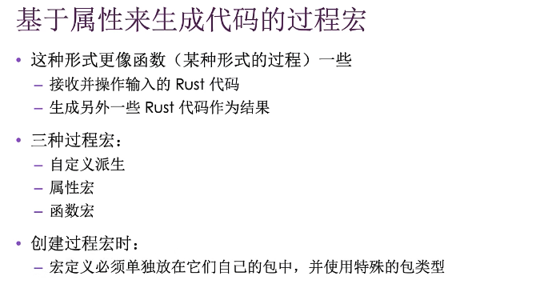

宏是代码展开 

macro_rules!

```rust
#[macro_export]//表明需要导入才能使用
macro_rules! vec {
    ($($e:expr),*) => {//这个，指的是会遇到逗号，*类似正则表达式表示会遇到多个
        {
            let mut v = Vec::new();
            $(//每次匹配都会执行这个代码块
                v.push($e);
            )*
            v
        }
    };
}
```



##### 自定义derive：适用于struct和enum

```rust
#[proc_macro_derive(HelloMacro)]
pub fn hello_macro_derive(input: TokenStream) -> TokenStream {
    let ast = syn::parse(input).unwrap();
    impl_hello_macro(ast)
}

pub fn impl_hello_macro(ast: &syn::DeriveInput) -> TokenStream {
    let name = &ast.ident;
    let gen = quote! {//展开文本
        impl HelloMacro for #name {
            fn hello_macro() {
                println!("Hello, Macro! My name is {}", stringify!(#name));//内置宏将token本身替换成字面值，比如ident是啥就是啥
            }
        }
    };
    gen.into()
}
```

##### 属性宏：

 -  适用于任意条目
 -  不是生产代码
 -  允许创建新属性

```rust

#[route(GET, "/")]
fn index() -> String {
    
}
#[proc_macro_attribute]
pub fn route(attr: TokenStream, item: TokenStream) -> TokenStream {//attr匹配GET，“/” item匹配fn

}
```

##### 类似函数的宏

```rust
#[proc_macro]
pub fn hello_macro(input: TokenStream) -> TokenStream {}
hello_macro! {
    fn hello_macro() {
        println!("Hello, Macro!");
    }
}
```


