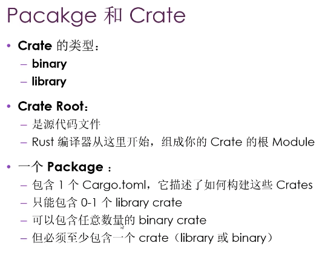
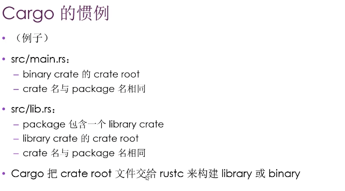
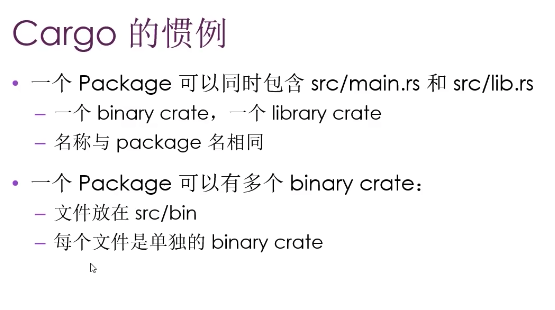

### 一、所有权

字符串

```rust
String::from();//栈中
"";//硬编码到程序中
```

```rust
let a = 0;
let b = a;//基础类型，复制值到栈上，a此时还有效

let c = String::from("");
let b = c;//堆上的数据，不会复制指针指向的内容，是复制的指针地址，所有权生效以防止double free，此时c失效（被move）
let d = b.clone();//d和b同时都有效
```

复制

- Copy trait可以用在那些能放在栈上的数据类型（所有大小确定的类型，比如char，tuple，数组）

- 如果实现了Copy，在赋值后依旧可以使用该变量
- 如果一个类型或者其局部实现了Drop，Rust不允许其实现Copy（Drop在被赋值后就会被销毁）

```rust
#[derive(Copy, Clone)]//如果没有实现copy和clone程序编译不过
struct Foo {
    a: i32,
    b: i32
}
/* Copy会和Drop冲突
impl Drop for Foo {
    fn drop(&mut self) {
        let _ = self.a;
        let _ = self.b;
    }
}*/
fn main() {
    let u = Foo { a: 1, b: 2  };
    let p= u;
    println!("{} {}", u.a, p.b);
}
/* Copy的类型 */
#[stable(feature = "rust1", since = "1.0.0")]
    Copy for
        usize, u8, u16, u32, u64, u128,
        isize, i8, i16, i32, i64, i128,
        f16, f32, f64, f128,
        bool, char,
        {T: ?Sized} *const T,
        {T: ?Sized} *mut T,
```


所有权在函数中的规则

- 一切实现了**Copy的都是传值**，一切在**heap上的都是被夺取所有权**

- heap上的数据和所有权同生同灭，所有权转移了表示生命周期还没玩（**所有权等同于生命周期，返回堆上数据==转移所有权**）

- 将变量指针传给函数叫**借用**，将变量地址赋值给变量叫**引用**

- **可变借用**只能同时存在**一个**，**不可变借用**可以**多个**（控制写不控制读，读写锁），可以通过放进更小作用域来解决对应的问题

  ```rust
  fn make(a: &mut String) {
      a.push_str("world");
  }
  fn main() {
      let mut a = String::from("hello");
      {
          let c = &mut a;
          c.push_str("ss");
      }
      make(&mut a);
  }
  ```

- 不能同时拥有不可变和引用

```rust
fn make(a: &mut String) {
    a.push_str("world");
}
fn main() {
    let mut a= String::from("hello");
    let c = &a;//不可变引用
    let e = &a;
    let mut d = &mut a;//可变引用
    make(&mut d);
    println!("{}", c);
}

let c = &a;
   |             -- immutable borrow occurs here
7  |     let e = &a;
8  |     let mut d = &mut a;
   |                 ^^^^^^ mutable borrow occurs here
9  |     make(&mut d);
10 |     println!("{}", c);
   |                    - immutable borrow later used here
```

Dangling Refer

- 引用必须一直有效

```rust
fn make<'a>(b: &'a mut String) -> &'a String {
    let mut a = String::from("hello");
    a.push_str(b);
    &a//报错，局部作用域变量强制随作用域销毁释放，防止悬垂指针
}
fn main() {
    let mut c= String::from("helloss");
    let s = make(&mut c);
    println!("{}", s);
}
```

切片

- **切片**是原变量（数组或向量）的部分引用，所以也受**不能同时拥有不可变和引用**的约束

```rust
fn main() {
    let mut u: Vec<u8> = Vec::new();
    u.push(3);
    u.push(4);
    u.push(3);
    u.push(4);
    let r = &u[..2];
    let c = &mut u[..];//报错
    println!("{:?}\n{:?}", r, c);
}
```

### 二、结构体

- 结构体成员和本体约束(周期，trait)相同，只有warning层面的宏可以单独定义字段

- 可以写成和es6的解构用..填充


```rust
struct Active {
    a: u8,
    b: u8,
    c: u8
}

fn main() {
    let active = Active { a: 1, b: 2, c: 3 };
    let active2 = Active {
        a: 1,
        ..active
    };
}

```

  Tuple Struct

```rust
struct Point(i32, i32);
```

Ulike Struct(结构本身没有数据，只用来实现Trait方法)

```rust
struct Controller;
impl ... for Controller {...}
```

打印结构体: {:?} {:#?}(可读性高，都是需要Debug的trait)


**关联方法**：第一个参数不是self，不需要实例上面调用

```rust
struct acc;
impl acc {
  new()-> Self {
    ...
  }
}
impl acc {//可以多次实现方法
  ....
}
acc::new();//::符号在rust中具有上下文关联的二义性，还代表enum，还有模块作用域
```

### 三、枚举

- enum默认公共成员

```rust
enum IP {
  V4(u8, u8, u8, u8),
  V6(String),//不会多存数据造成空间开销
  Other//还可以普通枚举
}

```

### 四、**Option**

提供None值的可能

## 五、逻辑

模式匹配，模式匹配的强大之处在于可以直接用别人的case来分发逻辑，而不用自己来定义逻辑

```rust
enum State {
    Active,
    Inactive,
    Pending(i32)
}

enum Dispatch { //generated by other one
    ConditionA,
    ConditionB,
    ConditionC(State)
}

fn main() {
    let dispatch = Dispatch::ConditionC(State::Active);
    let b = match dispatch {
        Dispatch::ConditionA => true,
        Dispatch::ConditionB => false,
        Dispatch::ConditionC(state) => {
            match state {
                State::Active => true,
                _ => false//等同switch的default，处理余下所有情况
            }
        }
        
    };
  	if let Dispatch::ConditionC(State::Active) = dispatch {//单匹配
        b = true;
    } else {//等同于上面的_，default
		}
    println!("{}", b);
}
```

## 六、模块

树的层级： Package -> Crate -> Module -> Path








#### super

- super可以获取mod上一层级的mod作用域

#### use

- 相对路径和绝对路径都可以
- 一般**函数**use都引用到函数的**上一级模块**就行

- 结构体 枚举：引用本身
- 同名条目引用到父级

```rust
use std::{self, collections::HashMap};//可以引用多层级 
use std::collections::*;//导入所有
```


#### pub use

- 等同于export ... from ...
