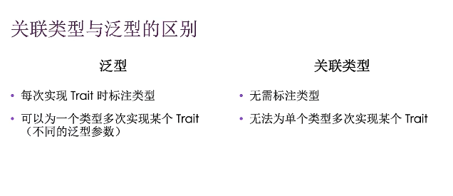

```rust
trait Foo {
    type Item;
    fn foo(&self) -> Self::Item;
}
```

默认泛型参数和运算符重载（`std::ops::*`中的操作)

```rust
trait Bar<T= i32> {
    fn bar(&self) -> T;    
}
//重载时右侧指定的默认参数类型是Self
//也可以自己实现trait时指定
```

##### 完全限定函数调用（as关键字）

```rust
trait Animal {
    fn name() -> String;
}

struct Dog {
    name: &'static str,
}
impl Animal for Dog {
    fn name() -> String {
        format!("{} is a animal", "ss")
    }
}
impl Dog {
    fn name() -> String {
        String::from("Dog")
    }
}
fn main(){
    let dog = Dog { name: "dog" };
    //println!("{}", (&dog as &dyn Animal).name());//方法参数有self时
    println!("{}", <Dog as Animal>::name());
    println!("{}", Dog::name());
}
```

##### Trait的继承

```rust
trait Animal: Display {//实现Animal必须实现Display，与其说是继承，语法上不如说是限定检查
    fn get_name(&self) -> String {
        String::from(self.to_string())
    }
}
struct Dog {
    name: &'static str,
}
impl Animal for Dog {
    fn get_name(&self) -> String {
        format!("{} is a animal", "ss")
    }
}
impl Display for Dog {
    fn fmt(&self, f: &mut std::fmt::Formatter<'_>) -> std::fmt::Result {
        write!(f, "{}", self.name)
    }
}
```

newtype模式（代理模式）

- 轻量级封装
- 语意明确

```rust
struct Wraper(Vec<i32>);//vec是外部类型
impl std::fmt::Display for Wraper {//Display也是外部trait，通过代理就可以重新实现trait
  fn fmt(...) {
    ....
  }
}
```

- 别名：`type UserNameType = String; type Thunk = Box<dyn Fn()+Send+'static>;type Result<T> = std::io::Result<T, Error>;`

never返回类型

```rust
loop {
  let guess: u32 = match guess.trim().parse() {
    Ok(num) => num,
    Err(_) => continue//永不返回
  }
}
fn main() -> ! {//永不返回
    loop {
        
    }
}
fn main() -> ! {
  panic("error")
}
```

**动态大小数据**

- str实际是一个堆上的数据类型，&str保存指针和长度

- 每个trait都是动态类型，可以通过名称引用

- trait用作trait对象时必须和指针共用

- - ```rust
    &dyn Trait  || Box<dyn Trait> || Rc<dyn Trait> || Box<dyn Fn() ->i32>
    ```

Sized Trait

- 编译时可计算大小的类型自动实现Sized
- 泛型默认限定Size`fn generic<T>(t: T){}`会隐式变`fn generic<T: Sized>(t: T){}`

?Sized Trait: 泛型的参数无法确定大小,表示传动态大小数据类型，比如Box\<dyn Trait\>

```rust
fn acc<T: ?Sized>(x: &T) -> &T { x }
```

