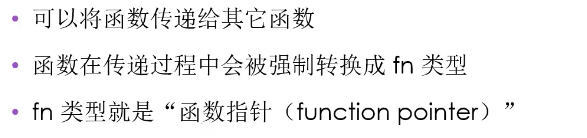
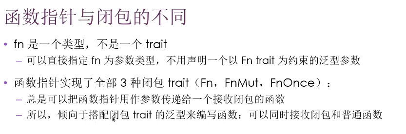

函数指针





重点：fn是类型，且实现所有闭包trait，所以可以传闭包的地方都可以传fn指针

```rust
enum Status {
  Value(u32),//实际上这就是一个构造函数，所以Status::Value能当作函数指针使用
  Stop
}
let list_of_statuses: Vec<Status> = (0u32..20)
		.map(Status::Value)//函数使用，map用的trait是FnMut
		.colloect();
```

闭包在使用时需要Box，主要是因为编译时期无法确定闭包的大小

